# PRAKTIKUM 1
1. Buat sebuah database dengan nama latihan2

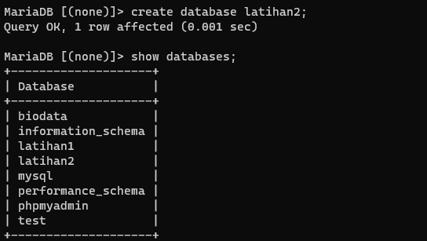

2. Buat sebuah tabel dengan nama biodata (nama, alamat) didalam database latihan1!

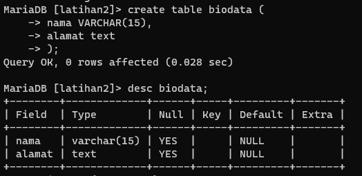

3. Tambahkan sebuah kolom keterangan (varchar 15), sebagai kolom terakhir!

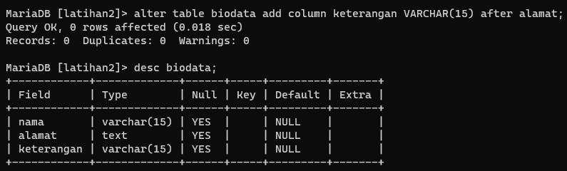

4. Tambahkan kolom id (int 11) di awal (sebagai kolom pertama)!

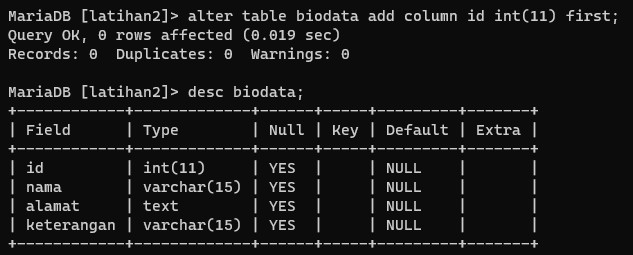

5. Sisipkan sebuah kolom dengan nama phone (varchar 15) setelah kolom alamat!

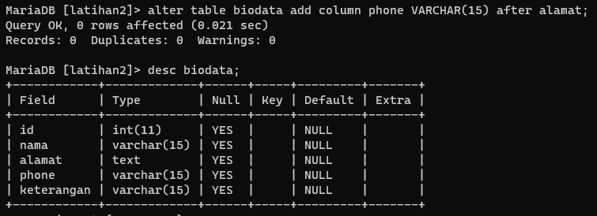

6. Ubah tipe data kolom id menjadi char(11)!

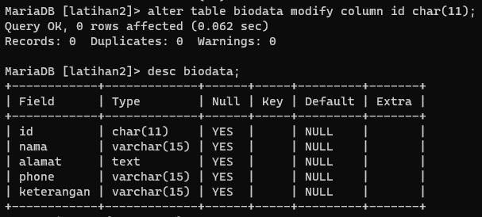

7. Ubah nama kolom phone menjadi hp (varchar 20)!

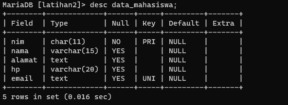

8. Tambahkan kolom email setelah kolom hp

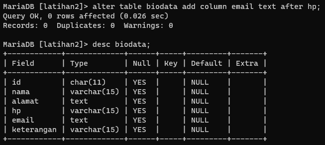

9. Hapus kolom keterangan dari tabel!

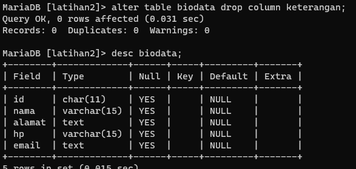

10. Ganti nama tabel menjadi data_mahasiswa!

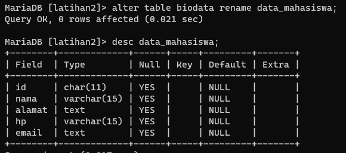

11. Ganti nama field id menjadi nim!

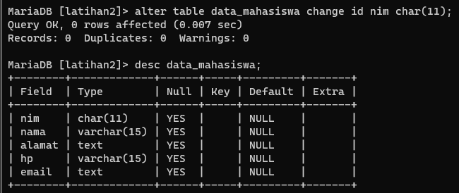

12. Jadikan nim sebagai PRIMARY KEY!

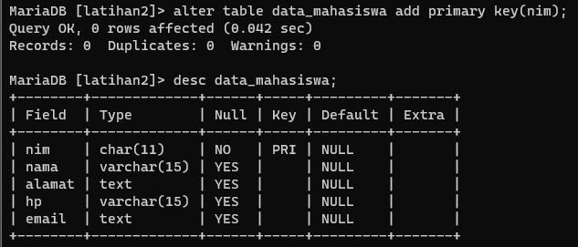

13. Jadikan kolom email sebagai UNIQUE KEY

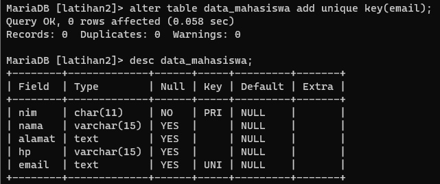

- Apa maksud dari int (11)?
adalah tipe data yang ukurannya tidak bisa lebih dari 11
- Ketika kita melihat struktur tabel dengan perintah desc, ada kolom Null yang berisi Yes dan No. Apa maksudnya ?
yes tidak di isi tidak masalah jika no harus di isi jikat tidak di isi error 
